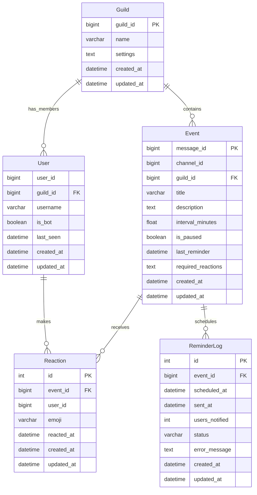

# Database Architecture - SQLite Migration

## Overview

This document describes the database architecture for the Discord Reminder Bot after the migration from JSON storage to SQLite with Pewee ORM. The new architecture provides improved data integrity, performance, and multi-server isolation.

## Architecture Components

### Database Layer Stack

```
┌─────────────────────────────────────┐
│         Discord Commands            │
├─────────────────────────────────────┤
│         EventManager               │
├─────────────────────────────────────┤
│         Pewee ORM Models           │
├─────────────────────────────────────┤
│         SQLite Database            │
└─────────────────────────────────────┘
```

### Core Components

1. **Database Connection Layer** (`persistence/database.py`)
   - SQLite connection management
   - Connection pooling and optimization
   - Environment-specific configurations

2. **ORM Models** (`models/database_models.py`)
   - Pewee-based model definitions
   - Data validation and serialization
   - Relationship management

3. **Schema Management** (`models/schema_manager.py`)
   - Database initialization
   - Migration management
   - Integrity verification

4. **Data Migration** (`utils/data_migration.py`)
   - JSON to SQLite migration
   - Data validation and transformation
   - Rollback capabilities

## Database Schema

### Entity Relationship Diagram



### Table Definitions

#### Guild Table
Stores Discord server information and settings.

| Column | Type | Constraints | Description |
|--------|------|-------------|-------------|
| guild_id | BIGINT | PRIMARY KEY | Discord guild ID |
| name | VARCHAR(100) | NOT NULL | Guild display name |
| settings | TEXT | DEFAULT '{}' | JSON-serialized guild settings |
| created_at | DATETIME | NOT NULL | Record creation timestamp |
| updated_at | DATETIME | NOT NULL | Last update timestamp |

#### User Table
Stores Discord user information per guild.

| Column | Type | Constraints | Description |
|--------|------|-------------|-------------|
| user_id | BIGINT | NOT NULL | Discord user ID |
| guild_id | BIGINT | FOREIGN KEY | Reference to Guild |
| username | VARCHAR(100) | NOT NULL | User display name |
| is_bot | BOOLEAN | DEFAULT FALSE | Whether user is a bot |
| last_seen | DATETIME | NOT NULL | Last activity timestamp |
| created_at | DATETIME | NOT NULL | Record creation timestamp |
| updated_at | DATETIME | NOT NULL | Last update timestamp |

**Indexes:**
- UNIQUE(user_id, guild_id) - One record per user per guild

#### Event Table
Stores event information for reminder tracking.

| Column | Type | Constraints | Description |
|--------|------|-------------|-------------|
| message_id | BIGINT | PRIMARY KEY | Discord message ID |
| channel_id | BIGINT | NOT NULL | Discord channel ID |
| guild_id | BIGINT | FOREIGN KEY | Reference to Guild |
| title | VARCHAR(200) | NOT NULL | Event title |
| description | TEXT | NULL | Event description |
| interval_minutes | FLOAT | DEFAULT 60.0 | Reminder interval |
| is_paused | BOOLEAN | DEFAULT FALSE | Whether reminders are paused |
| last_reminder | DATETIME | NOT NULL | Last reminder timestamp |
| required_reactions | TEXT | DEFAULT '["✅", "❌", "❓"]' | JSON array of required emojis |
| created_at | DATETIME | NOT NULL | Record creation timestamp |
| updated_at | DATETIME | NOT NULL | Last update timestamp |

**Indexes:**
- (guild_id, is_paused) - For finding active events per guild
- (last_reminder, interval_minutes) - For scheduler queries
- (guild_id, created_at) - For chronological queries per guild

#### Reaction Table
Stores user reactions to events.

| Column | Type | Constraints | Description |
|--------|------|-------------|-------------|
| id | INTEGER | PRIMARY KEY | Auto-increment ID |
| event_id | BIGINT | FOREIGN KEY | Reference to Event |
| user_id | BIGINT | NOT NULL | Discord user ID |
| emoji | VARCHAR(10) | NOT NULL | Reaction emoji |
| reacted_at | DATETIME | NOT NULL | Reaction timestamp |
| created_at | DATETIME | NOT NULL | Record creation timestamp |
| updated_at | DATETIME | NOT NULL | Last update timestamp |

**Indexes:**
- UNIQUE(event_id, user_id) - One reaction per user per event
- (event_id, emoji) - For filtering by emoji type

#### ReminderLog Table
Stores reminder history and status.

| Column | Type | Constraints | Description |
|--------|------|-------------|-------------|
| id | INTEGER | PRIMARY KEY | Auto-increment ID |
| event_id | BIGINT | FOREIGN KEY | Reference to Event |
| scheduled_at | DATETIME | NOT NULL | When reminder was scheduled |
| sent_at | DATETIME | NULL | When reminder was sent |
| users_notified | INTEGER | DEFAULT 0 | Number of users notified |
| status | VARCHAR(20) | DEFAULT 'pending' | Status: pending, sent, failed |
| error_message | TEXT | NULL | Error details if failed |
| created_at | DATETIME | NOT NULL | Record creation timestamp |
| updated_at | DATETIME | NOT NULL | Last update timestamp |

**Indexes:**
- (event_id, scheduled_at) - For chronological queries per event
- (status, scheduled_at) - For finding pending/failed reminders

## Database Configuration

### SQLite Pragmas

The database is configured with optimized SQLite pragmas:

```python
pragmas = {
    'journal_mode': 'wal',          # Write-Ahead Logging for concurrency
    'cache_size': -1 * 64000,       # 64MB cache
    'foreign_keys': 1,              # Enable foreign key constraints
    'ignore_check_constraints': 0,   # Enable check constraints
    'synchronous': 0,               # Asynchronous writes for performance
}
```

### Connection Management

- **Single Connection**: One database connection per bot instance
- **Connection Pooling**: Managed by Pewee ORM
- **Auto-reconnect**: Automatic reconnection on connection loss
- **Graceful Shutdown**: Proper connection cleanup on bot shutdown

## Data Isolation

### Multi-Server Isolation

All data operations are automatically isolated by `guild_id`:

1. **Automatic Filtering**: All queries include guild_id filtering
2. **Data Integrity**: Foreign key constraints ensure referential integrity
3. **Cross-Server Prevention**: No accidental data leakage between servers
4. **Independent Operations**: Each server operates independently

### Security Measures

- **Input Validation**: All user inputs are validated before database operations
- **SQL Injection Prevention**: Pewee ORM provides automatic parameterization
- **Access Control**: Role-based permissions for administrative operations
- **Data Sanitization**: Automatic escaping of special characters

## Performance Optimizations

### Indexing Strategy

1. **Primary Keys**: All tables have optimized primary keys
2. **Foreign Keys**: Indexed for fast joins
3. **Query Patterns**: Indexes match common query patterns
4. **Composite Indexes**: Multi-column indexes for complex queries

### Query Optimization

- **Lazy Loading**: Related objects loaded only when needed
- **Batch Operations**: Multiple operations combined into transactions
- **Connection Reuse**: Single connection for related operations
- **Query Caching**: Frequently used queries are cached

### Memory Management

- **Connection Pooling**: Efficient connection reuse
- **Result Streaming**: Large result sets streamed to avoid memory issues
- **Garbage Collection**: Proper cleanup of database objects
- **Cache Management**: Intelligent cache eviction policies

## Migration Strategy

### JSON to SQLite Migration

The migration process follows these steps:

1. **Backup Creation**: Automatic backup of existing JSON files
2. **Data Validation**: Validation of JSON data integrity
3. **Schema Creation**: Database tables and indexes creation
4. **Data Transformation**: JSON data converted to relational format
5. **Integrity Verification**: Post-migration data validation
6. **Rollback Capability**: Ability to revert to JSON if needed

### Migration Components

- **DataMigration Class**: Main migration orchestrator
- **Validation System**: Comprehensive data validation
- **Error Handling**: Robust error recovery and reporting
- **Progress Tracking**: Migration progress monitoring
- **Rollback System**: Safe rollback to previous state

## Monitoring and Maintenance

### Health Checks

- **Connection Status**: Database connection health monitoring
- **Schema Integrity**: Regular schema validation
- **Performance Metrics**: Query performance tracking
- **Error Monitoring**: Database error detection and alerting

### Maintenance Operations

- **Vacuum Operations**: Regular database optimization
- **Index Maintenance**: Index usage analysis and optimization
- **Log Rotation**: Reminder log cleanup and archival
- **Backup Management**: Automated backup creation and retention

## Development Guidelines

### Model Development

1. **Inherit from BaseModel**: All models must inherit from BaseModel
2. **Validation Methods**: Implement validate_data() for all models
3. **Serialization**: Use SerializationMixin for JSON conversion
4. **Documentation**: Document all model fields and methods

### Query Guidelines

1. **Guild Isolation**: Always filter by guild_id
2. **Index Usage**: Write queries that utilize existing indexes
3. **Transaction Management**: Use transactions for multi-table operations
4. **Error Handling**: Implement proper error handling for all database operations

### Testing Requirements

1. **Unit Tests**: Test all model methods and validations
2. **Integration Tests**: Test complete workflows
3. **Performance Tests**: Validate query performance
4. **Migration Tests**: Test migration scenarios

## Troubleshooting

### Common Issues

1. **Connection Errors**: Check database file permissions and path
2. **Migration Failures**: Verify JSON data integrity and format
3. **Performance Issues**: Analyze query patterns and index usage
4. **Data Corruption**: Use integrity checks and backup restoration

### Diagnostic Tools

- **Database Status**: `get_database_status()` function
- **Table Information**: `get_table_info()` function
- **Schema Validation**: `verify_database_integrity()` function
- **Migration Logs**: Detailed migration process logging

## Future Considerations

### Scalability

- **Sharding**: Potential database sharding for very large deployments
- **Read Replicas**: Read-only replicas for improved performance
- **Caching Layer**: External caching for frequently accessed data
- **Connection Pooling**: Advanced connection pool management

### Feature Enhancements

- **Full-Text Search**: SQLite FTS for event content search
- **Analytics**: Advanced analytics and reporting capabilities
- **Archival**: Automated data archival for old events
- **Backup Strategies**: Enhanced backup and disaster recovery